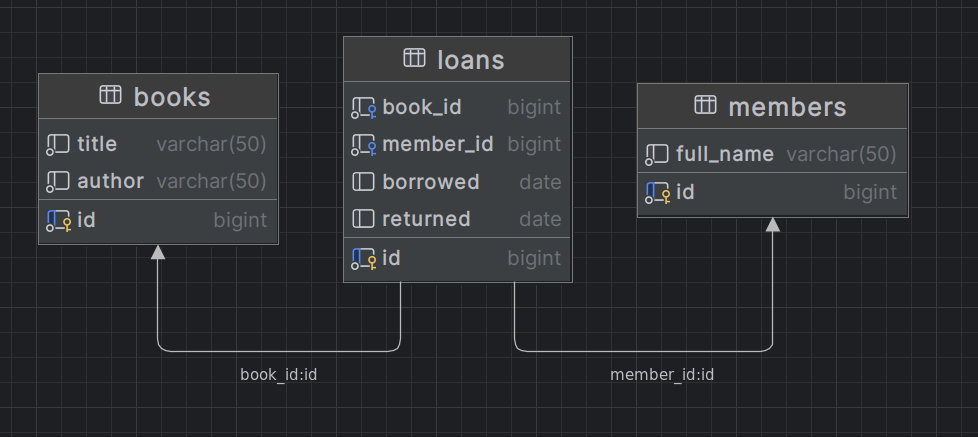

# Library Assessment

The Library API has been written in go connecting to a Postrgress database  
using SQL. The REST API uses gorrila/mux. The API is not exhaustive, as it  
is my understanding from the brief that members and books can be static,  
and the database is prepopulated with data.  
The API has elements of a production quality API such as login and error handling,   
but other aspects such as CI/CD and configs (via flags) are not implemented  
at the time of writing this document. Other aspects such as the db setup/main.go are  
not production quality solutions.

Some edge cases have been considered such as borrowing a book thats already on loan.

While I have attempted to stick to the golang idiomatic approach,  
some non-idiomatic influences may have crept in. I am open to feedback on this.

Development was done using Intellij Ultimate with the go plugin  
on an Ubuntu 22 laptop.

## Database structure
The books and members tables have a many to many relationship.  
The link table - loans also contains borrowed an returned dates  
to keep track of when a book is on loan.



## Endpoints
### Home
http://localhost:8080/

### Get book by ID
http://localhost:8080/books/1

### Get books read by member ID
http://localhost:8080/booksRead/1

### Get member by ID
http://localhost:8080/members/2

### Borrow book by book and member ID
http://localhost:8080/borrow  
JSON request payload
```json
{
    "BookId": 4,
    "MemberId": 1
}
```

Return book by book and member ID  
http://localhost:8080/return  
JSON request payload
```json
{
    "BookId": 4,
    "MemberId": 1
}
```
## Postman Collection
There is a postman collection in the docs folder,  
that can be used to test the endpoints.   
The requests are available as curl commands below.
```shell
curl --location --request GET 'http://localhost:8080/books/6' --data-raw ''

curl --location --request GET 'http://localhost:8080/booksRead/1' --data-raw ''

curl --location --request GET 'http://localhost:8080/members/2' --data-raw ''

curl --location --request POST 'http://localhost:8080/borrow' \
--header 'Content-Type: application/json' \
--data-raw '{
    "BookId": 4,
    "MemberId": 1
}'

curl --location --request PATCH 'http://localhost:8080/return' \
--header 'Content-Type: application/json' \
--data-raw '{
    "BookId": 4,
    "MemberId": 1
}'
```

## Running the API
### The db
```shell
docker pull postgres
```
```shell
docker run --name library -e POSTGRES_PASSWORD=password --publish 5432:5432 -d postgres
```  
Create and populate the db. Only needs to be done once or to reset db data
```shell
 go run ./setup/main.go
```  
### The API
```shell
go run main.go
```